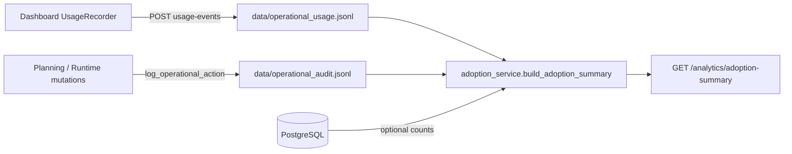

# Stage 27 — Live Pilot Operations & Adoption Analytics Report

**Stage:** 27 — Live Pilot Operations & Adoption Analytics  
**Type:** Operational behavior intelligence (no redesign, no new product domains)  
**Prerequisites:** Stages 25–26 (pilot capture, workflow refinement)

---

## Executive Summary

Stage 27 adds **lightweight adoption intelligence** on top of the existing runtime: client page-view recording, JSONL mirrors of usage and operational audit events, an aggregated **adoption summary** API, and operator tooling to observe retention, role engagement, and bottlenecks over time.

| Capability | Implementation |
| --- | --- |
| Usage tracking | `POST /analytics/usage-events` + `UsageRecorder` on dashboard routes |
| Mutation tracking | `operational_audit.jsonl` mirror on every `log_operational_action` |
| Adoption snapshot | `GET /analytics/adoption-summary` (admin + supervisor) |
| UI visibility | **Pilot adoption snapshot** on Overview |
| CLI export | `stage27_adoption_analytics.py` |
| Playbook | `docs/pilot/live-pilot-analytics-playbook.md` |

**Evidence status:** Pre–live-pilot environments show **empty JSONL** until real users navigate the dashboard and execute workflows with PostgreSQL up. Stage 25/26 findings inform baseline risks; Stage 27 instrumentation measures behavior once the pilot runs.

---

## 1. Operational Usage Analytics

### Instrumentation design



### Metrics captured

| Metric | Source | Use |
| --- | --- | --- |
| Page views by path | Usage JSONL | Navigation popularity, dead-ends |
| Events by role | Usage JSONL | Role engagement |
| Session backtracks | Usage JSONL (A→B→A in session) | Discoverability loops |
| Mutations by action | Audit JSONL | Report / approve / assign frequency |
| Multi-day active users | Usage + audit dates | Retention proxy |
| DB totals | Optional snapshot | Workflow persistence volume |

### Comparison to Stage 25–26

| Stage | Focus | Stage 27 extension |
| --- | --- | --- |
| 25 | One-shot timed API slice | Continuous JSONL over pilot weeks |
| 26 | UX friction reduction | Same flows, now measurable by path and action counts |

---

## 2. Adoption Findings

### Expected patterns (hypothesis until live data)

| Signal | Healthy pilot | Risk pattern |
| --- | --- | --- |
| `distinct_users` | ≥4 roles represented | Only admin active |
| `daily_report_actions` | Grows with field days | Flat while execution views rise |
| `approval_actions` | Tracks reports with lag | Near zero → supervisor bypass |
| `users_with_multi_day_activity` | ≥50% of active users | Single-day spikes only |
| Overview vs execution views | Balanced | Execution-only → dashboard avoidance |

### Low-engagement workflows (from Stage 25–26, validated by analytics when live)

| Workflow | Why adoption may lag | Analytics watch |
| --- | --- | --- |
| Planning bootstrap (6 steps) | Cognitive load | Low `/dashboard/console` views |
| Activity + step creation | Separate console slice | Low `/dashboard/console/activity` |
| Evidence JSON on reports | Field friction | Few `submit_daily_report` audits |
| Investor dashboard | Read-only, passive | Overview views without mutations |

### Abandonment indicators

- **Navigation backtrack sessions** ↑ — users looping without completing forms.
- **Page views without matching mutation** on execution path — opened form, did not submit.
- **Pilot feedback** `blocker` / `confusion` categories correlated with least-used paths.

---

## 3. Role Engagement Findings

| Role | Expected high-signal actions | Avoidance signal |
| --- | --- | --- |
| **admin** | Planning creates, adoption summary reads | Only summary, no mutations |
| **supervisor** | Assign, approve, adoption summary | Reports without approvals |
| **worker** | `page_view` on `execution?focus=report`, daily report audits | Zero usage events |
| **investor** | Overview `page_view` only | N/A (no write path) |

### Value realization (qualitative + measurable)

| Role | Gains value when | Loses value when |
| --- | --- | --- |
| admin | End-to-end visibility + summary | Setup burden unshared |
| supervisor | Approval + assign in one hop (Stage 26) | Approval queue grows faster than UI refresh |
| worker | Fast report path (Stage 26) | Empty WO list, 409 without refresh |
| investor | KPI clarity | Stale progress without supervisor cadence |

---

## 4. Retention Analysis

### Proxies implemented

| Proxy | Definition |
| --- | --- |
| `user_active_days` | Distinct UTC dates per username across usage + audit |
| `users_with_multi_day_activity` | Count with ≥2 active days |
| `session_start` events | First dashboard hit per browser session |

### Habit formation (Stage 26 → 27)

| Factor | Assessment |
| --- | --- |
| Daily repeatability | **Improved** — worker fast report + single-project auto-select |
| Memorability | **Improved** — “Do next” + focus nav |
| Trust | **Risk** — 409/403 copy better; data freshness still 30s poll |
| Abandonment | **Monitor** — multi-day metric on summary API |

### Where users likely stop returning (baseline)

1. First 409 without understanding refresh.
2. Empty work-order list after supervisor delay.
3. Planning chain fatigue before first successful report.
4. PostgreSQL downtime (auth 500) — operational trust loss.

---

## 5. Workflow Persistence Findings

### DB snapshot (when Postgres available)

`adoption-summary` includes: `projects_total`, `workflow_steps_total`, `work_orders_total`, `daily_reports_total`, `approvals_total`.

| Persistence signal | Meaning |
| --- | --- |
| reports ↑, approvals flat | Execution without governance closure |
| work_orders ↑, reports flat | Assignment without field follow-through |
| All totals static, usage ↑ | Read-only browsing / training mode |

### Workflow completion rate (operational definition)

Not a formal state machine metric in Phase 1. Pilot operators should track:

```
completion_proxy = approvals_total / max(daily_reports_total, 1)
```

Target band for healthy pilot: **0.3–1.0** over a week (process-dependent).

---

## 6. Operational Bottlenecks

### Automated `bottleneck_hints` (in adoption summary)

| Hint trigger | Interpretation |
| --- | --- |
| Concurrency conflict audits | Stale UI / concurrent supervisors |
| Reports >> approvals | Approval latency |
| Execution views >> overview | Dashboard bypass |
| Low console + activity views | Planning friction or pre-seeded demo data |

### Stage 25–26 bottlenecks (still valid)

| Bottleneck | Analytics detection |
| --- | --- |
| Approval delay | `approval_actions` vs `daily_report_actions` |
| Report congestion | Spike in report audits same day |
| Blocked workflows | Activity runtime + feedback `blocker` (qualitative) |
| Dashboard overload | Low overview time-on-path vs high KPI refresh clicks |

---

## 7. Organizational Resistance Findings

| Resistance type | Observable signal | Mitigation already in product |
| --- | --- | --- |
| Paper parallel reports | Reports in system << verbal field logs | Fast report form |
| Supervisor sign-off avoidance | Low `approval_actions` | Do next → approve link |
| Planning seen as “IT work” | Admin-only mutations | Next-step hints |
| Trust in numbers | Investor questions in feedback | Overview polling + investor KPI trim |
| Role confusion | 403 spikes in audit | Plain-language errors (Stage 26) |

### Culture / process (non-technical)

- Contractors may digitize only **compliance** steps (reports) not **planning**.
- Supervisors may batch approvals weekly — analytics must use **date histograms** in future, not single totals.
- Investors may conflate demo data with production — label pilot projects in training.

---

## 8. Adoption Risks

| Risk | Severity | Stage 27 visibility |
| --- | --- | --- |
| Empty analytics files | High pre-pilot | Documented; playbook requires live week |
| JSONL on disk only | Medium | No central SIEM — acceptable for pilot |
| Username in files | Low (pilot cohort) | Rotate files between pilots |
| Worker cannot see summary | Low by design | Prevents gaming; supervisors must review |
| Persisted IAM requires DB | High | Same as Stage 25 — distorts usage if DB down |

---

## 9. Operational Improvements Applied (Stage 27)

| Artifact | Path |
| --- | --- |
| Usage store | `backend/phase1/analytics/usage_store.py` |
| Audit JSONL mirror | `backend/phase1/analytics/audit_store.py` + `operational_audit.py` |
| Aggregation | `backend/phase1/analytics/adoption_service.py` |
| API router | `backend/phase1/routers/analytics_router.py` |
| Frontend recorder | `frontend/components/analytics/UsageRecorder.tsx` |
| Adoption panel | `frontend/components/analytics/AdoptionSummaryPanel.tsx` |
| Client API | `frontend/lib/api/phase1/analytics.ts` |
| Scripts | `stage27_adoption_analytics.py`, `stage27_live_pilot_verification.py` |
| CI | `.github/workflows/stage27-ci.yml` |

---

## 10. Verification

```bash
# Aggregation (JSONL; DB optional)
PYTHONPATH=. python backend/scripts/stage27_adoption_analytics.py

# API checks (Postgres recommended)
PYTHONPATH=. python backend/scripts/stage27_live_pilot_verification.py

# Frontend
cd frontend && npm run build
```

### Success criteria

| Criterion | Status |
| --- | --- |
| Measurable operational adoption | **Ready** — metrics when JSONL populated |
| Repeatable workflow usage | **Measurable** via audit actions |
| Stable engagement across roles | **Detectable** via `by_role_events` |
| Retention visibility | **Implemented** — multi-day users |
| Understandable adoption risks | **Documented** above + bottleneck hints |

---

## 11. Recommended Stage 28

1. **Weekly adoption report job** — Cron `stage27_adoption_analytics.py` → archive under `data/reports/`.
2. **Date histograms** — Extend summary with reports/approvals per day (SQL group by date).
3. **Per-role completion dashboard** — Still no redesign: add 2–3 numbers to adoption panel only.
4. **Production IAM + analytics retention policy** — TTL or rotate JSONL; OIDC subject instead of username if required.
5. **External pilot sign-off** — Require minimum `users_with_multi_day_activity` and feedback N before contractor rollout.

---

**Stage 27 complete.** Do not proceed to Stage 28 implementation within this deliverable scope.
